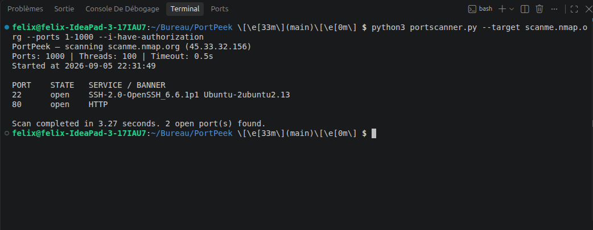

# PortPeek

Un scanner de ports TCP simple et multithreadé, écrit en Python. PortPeek
teste une plage (ou une liste) de ports sur une cible et indique lesquels
sont ouverts, avec une tentative d'identification du service via une bannière
ou une liste de ports courants.

> ⚠️ **Avertissement légal** : n'utilise PortPeek que sur des systèmes que tu
> possèdes ou pour lesquels tu as une autorisation écrite explicite. Scanner
> des systèmes sans permission peut être illégal selon la juridiction. L'outil
> demande explicitement le flag `--i-have-authorization` avant de lancer un
> scan, comme rappel.


## Pourquoi ce projet

Le scan de ports est une des bases de la reconnaissance réseau en pentest. Ce projet vise à comprendre son fonctionnement de A à Z (résolution DNS, sockets TCP, multithreading) plutôt que de se contenter d'utiliser Nmap en boîte noire.

## Fonctionnement

1. Le nom d'hôte ou l'IP cible est résolu en adresse IP.
2. La liste des ports à tester est construite (plage ou liste explicite).
3. Un pool de threads tente une connexion TCP sur chaque port en parallèle
   (`socket.connect_ex`), ce qui évite d'attendre chaque port un par un.
4. Pour chaque port qui répond, PortPeek tente de récupérer une bannière
   (certains services s'annoncent juste après la connexion, comme SSH ou
   FTP) ; sinon il affiche le nom de service usuel associé à ce port.
5. Le résultat est affiché trié par numéro de port.

## Installation

```bash
git clone https://github.com/<toi>/portpeek.git
cd portpeek
```

Aucune dépendance externe : uniquement des modules intégrés à Python
(`socket`, `argparse`, `concurrent.futures`). Python 3.9+ requis.

## Utilisation

```bash
python portscanner.py --target 127.0.0.1 --ports 1-1024 --i-have-authorization
```

### Options

| Option | Description |
|---|---|
| `--target` | IP ou nom d'hôte de la cible (obligatoire) |
| `--ports` | Ports à scanner : plage (`1-1024`) ou liste (`22,80,443`). Défaut : `1-1024` |
| `--timeout` | Timeout de connexion en secondes (défaut : `0.5`) |
| `--threads` | Nombre de threads simultanés (défaut : `100`) |
| `--i-have-authorization` | Confirmation obligatoire que tu es autorisé à scanner la cible |

### Exemple

```bash
python portscanner.py --target scanme.nmap.org --ports 1-1000 --i-have-authorization
```

Test effectué contre [scanme.nmap.org](https://nmap.org/book/testing.html), la cible de test officiellement fournie par les créateurs de Nmap pour s'entraîner légalement au scan réseau.



**Interprétation du résultat :**

- Sur les 1000 ports testés (1 à 1000), seuls **2 sont ouverts** — le reste est fermé ou filtré, ce qui est cohérent avec une machine correctement sécurisée.
- **Port 22 (SSH)** : le service s'est annoncé de lui-même dès la connexion, ce qui a permis à PortPeek de capturer sa bannière exacte (`OpenSSH_6.6.1p1` sur Ubuntu). En pentest réel, cette information servirait ensuite à vérifier si cette version précise possède des vulnérabilités connues (CVE).
- **Port 80 (HTTP)** : ouvert également, mais sans bannière capturée — les serveurs web n'envoient rien tant qu'ils ne reçoivent pas une vraie requête. PortPeek retombe alors sur le nom de service générique associé au port.
- Le scan complet a pris **3,27 secondes** grâce au multithreading — une version séquentielle (un port à la fois) aurait pris plusieurs minutes sur la même plage.

## Structure du projet

```
portpeek/
└── portscanner.py   # tout le scanner : parsing d'arguments, scan, affichage
```

Volontairement en un seul fichier pour ce projet — c'est assez petit pour
rester lisible, contrairement à un projet plus gros où découper en modules
devient utile.

## Limites connues

- Scan TCP « connect » classique uniquement (pas de scan SYN furtif comme
  Nmap, qui nécessite des privilèges root et l'accès aux sockets brutes).
- La récupération de bannière est basique : certains services ne renvoient
  rien tant qu'on ne leur envoie pas une requête adaptée (ex. HTTP a
  besoin d'un `GET` pour répondre).
- Pas de détection de version précise (contrairement à `nmap -sV`).

## Pistes d'amélioration

- [ ] Scan UDP en plus du TCP
- [ ] Détection de version plus fine (envoyer une requête adaptée par service)
- [ ] Export des résultats en JSON/CSV
- [ ] Barre de progression pendant le scan

## Licence

MIT.
